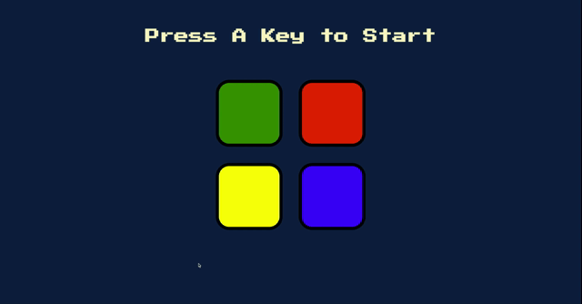

# SIMON - Game
Can you repeat the pattern? Test your memory in this fun mini game built using jQuery and CSS.

##### Live Demo
[Play](https://nadinejuraschek.github.io/Simon-Game/) the game!

## How to Play

1. Press any key to start the game.

2. Watch and listen which button the computer chooses.

3. Repeat the given signal by clicking on the same button.

4. Pay attention to the next button chosen.

5. Repeat ALL previouly pressed buttons in the right order.

6. The game will continue as long as you can repeat the sequence correctly.

## Technologies
* jQuery
* JavaScript
* CSS

## Preview
